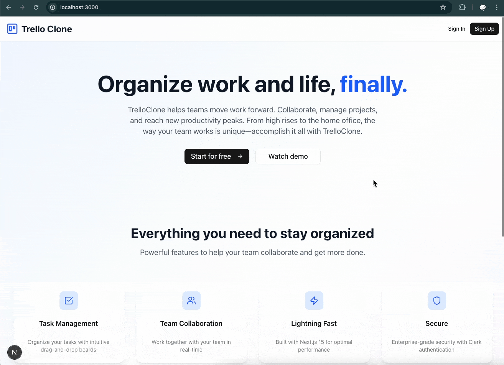

⚠️In progress...⚠️

<h3 align="center">Trello Clone</h3>

## Table of Contents

1. [Introduction](#introduction)
2. [Note](#note)
3. [Demo](#demo)
4. [Tech Stack](#tech-stack)
5. [Features](#features)
6. [Quick Start](#quick-start)
7. [What I learned](#learn)
8. [Implementation Notes](#implementation-notes)

## <a name="introduction">Introduction</a>

TODO

## <a name="note">⚠️ Note</a>

TODO
This project was implemented based on a tutorial video on YouTube from freeCodeCamp [Build a Fullstack Trello App with NextJS 15, Supabase, TailwindCSS, Drag & Drop](https://www.youtube.com/watch?v=ugxI1o5SyMs).

## <a name="demo">Demo</a>

TODO
Click on each section to toggle the demo image.

<!--
<details>
  <summary>
    Authentication
  </summary>
  <b>Sign up</b>
  <div>
    <a href="">
        
    </a>
  </div>
  <b>Sign in</b>
  <div>
    <a href="">
      
    </a>
  </div>
</details>
<details>
  <summary>
    Authenticated User
  </summary>
  <div>
    <b>Create Availability Schedule</b>
    <div>
      <a href="">
        
      </a>
    </div>
    <b>Create Active Event</b>
    <div>
      <a href="">
        
      </a>
    </div>
    <b>Create Inactive Event</b>
    <div>
      <a href="">
        
      </a>
    </div>
    <b>Edit Event</b>
    <div>
      <a href="">
        
      </a>
    </div>
    <b>Delete Event</b>
    <div>
      <a href="">
        
      </a>
    </div>
  </div>
</details>

<details>
  <summary>
    Non-Authenticated User
  </summary>
  <div>
    <b>See Public profile from Profile's Link</b>
    <div>
      <a href="">
        
      </a>
    </div>
    <b>Booking Event from Event's link</b>
    <div>
      <a href="">
        
      </a>
    </div>
    <b>Invitation Email</b>
    <div>
      <a href="">
        
      </a>
    </div>
    <b>Google Calendar after accept invitation</b>
    <div>
      <a href="">
        
      </a>
    </div>
    <b>Available time slot will be updated according to events in Google Calendar</b>
    <div>
      <a href="">
        
      </a>
    </div>
  </div>
</details>
-->

## <a name="tech-stack">Tech Stack</a>

TODO

- Next.js - React framework for full-stack web application development
- React - JavaScript library
- TypeScript - JavaScript superset for type safety
- Supabase – cloud PostgreSQL database service @supabase/
- Clerk - Authentication & subscription billing integration Middleware with pre-built UI components and themes
- Tailwind CSS v4 - CSS framework
- Shadcn UI - UI component library using primitives from Radix UI
- @dnd-kit – Primitives, Hook and functionality for create Drag‑and‑drop UI (I used `@dnd-kit/core`, `@dnd-kit/sortable` and `@dnd-kit/utilities`) TODO
- Lucide React - Icon library for React
- Class Variance Authority - TODO
- tw-animate-css - Collection of utility classes for Tailwind CSS animations

## <a name="features">Features</a>

TODO

## <a name="quick-start">Quick Start</a>

TODO
Follow these steps to set up the project locally on your machine.

### Prerequisites

- Git
- Node.js
- npm

### Cloning the Repository

```bash
git clone https://github.com/bank8426/calendly-clone-next.git
cd calendly-clone-next
```

### Installation

Install the project dependencies using npm:

```bash
npm install
```

### Set Up Environment Variables

1. Create a new file named `.env` and copy the content inside `.env.example`
2. Replace the placeholder values with your actual credentials

```env

```

### Running the Project

```bash
npm run dev
```

Your server will run on [http://localhost:3000](http://localhost:3000/)

## <a name="learn">What I learned</a>

TODO

`Supabase`

- Supabase, Row Level Security (RLS) policies are `PostgreSQL rules` to restrict access to data(SELECT, INSERT, UPDATE and DELETE) in a table based on a user's identity or attributes. Benefit of this is to not let other user can see another user date by config on database level. And by default when you enable RLS,there will be no rule yet which make you can't access or do anything until set it up. To set it you just need to create a condition that you want and apply to all SELECT, INSERT, UPDATE and DELETE which will use same condition.

`tailwind`

- class `group` `group-hover`

- React
- Create custom context, provider , hook

## <a name="implementation-note">Implementation Notes</a>

TODO

Clerk & Supabase integration
RLS
(auth.uid())::text) and requesting_user_id()

APP
App stuck at Loading when session expired without display navbar bacuase not handle sesion well in SupabaseProvider.tsx
https://clerk.com/docs/nextjs/reference/hooks/use-session

```js
    const { isLoaded: isSessionLoaded, session } = useSession();
    ...
    useEffect(() => {
      // when still loading session
      if (!isSessionLoaded && !session) {
        return;
      }
      ... // the rest of code
    }, [isSessionLoaded, session]);
```

## <a name="missing">Missing Features</a>

TODO

- Board page
  - filter by assignee
- Dashboard page
  - filter boards by task count

## <a name="Known Bugs">Known Bugs</a>

- Reordering Tasks result in move Task to another Column
  - This happened when drag and drop one task over another task that has `id` matched with `Task id` and also `Column id` of different Column. When `handleDragEnd` is executed, The code inside of `handleDragEnd` will consider this action as `move task to another column` since it matched the first condition of `if-else` which check if `over.id is matched with column.id` which give unintended result. But this can't fix by rearrange `if-else` condition. Root cause is from when we setup `table` in `db` because we use `number` as `id` which mean it is `not unique` and `can be miss use` for `id` in `other table` that also use `number` as `id`. I try try to migrate type of `id` to `uuid` but it not allowed even clean up all data.
