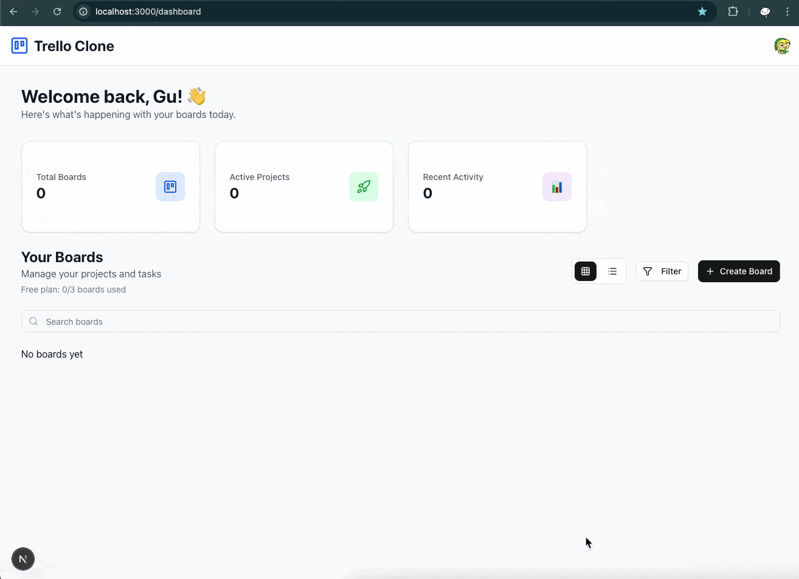
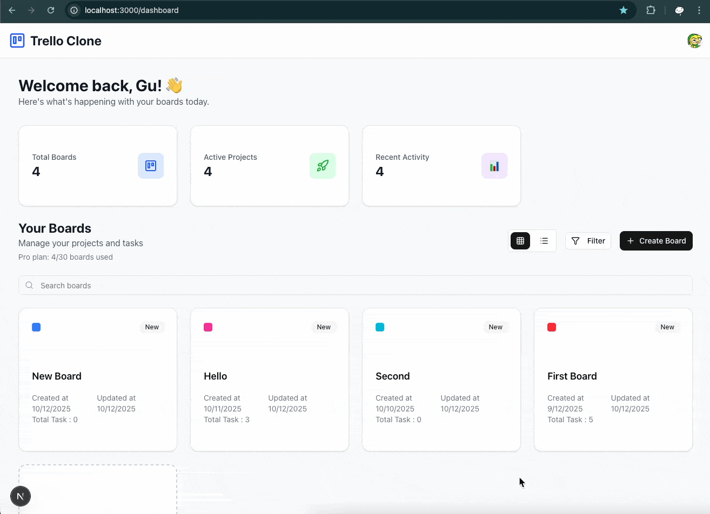
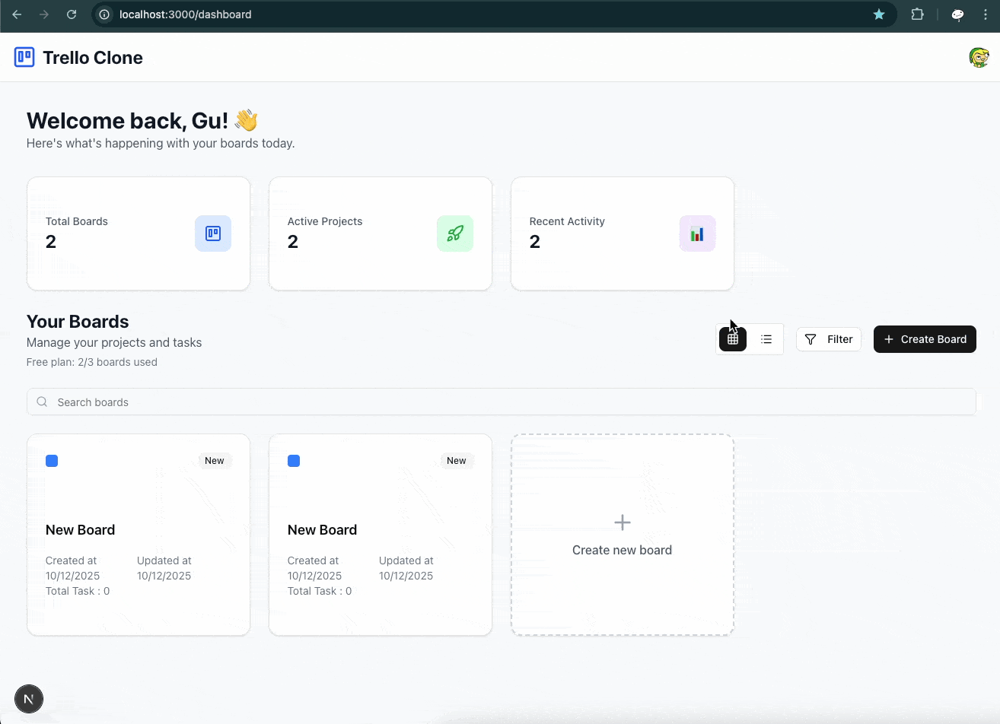
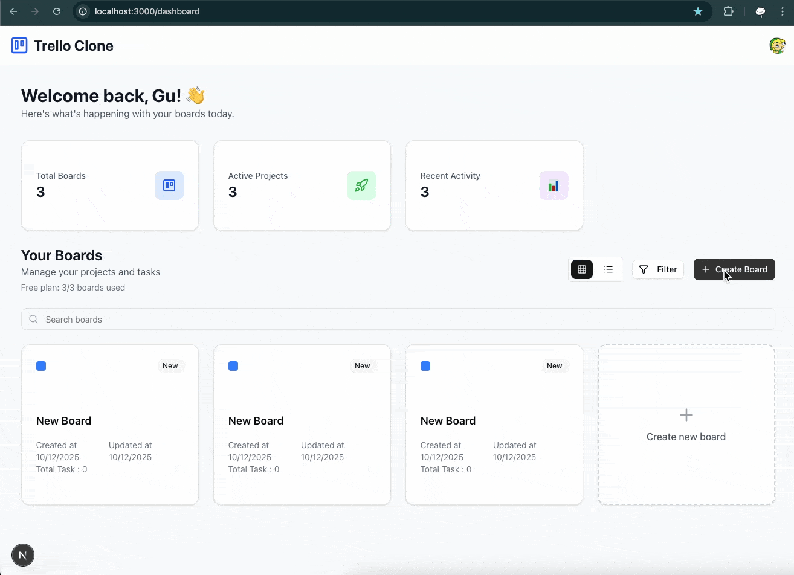
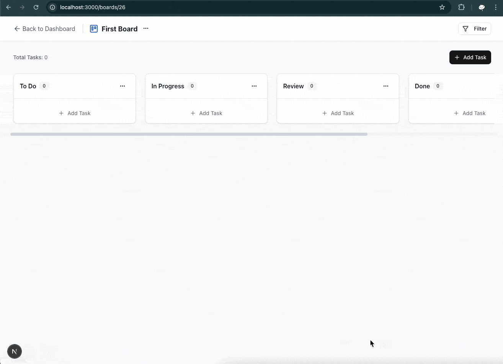
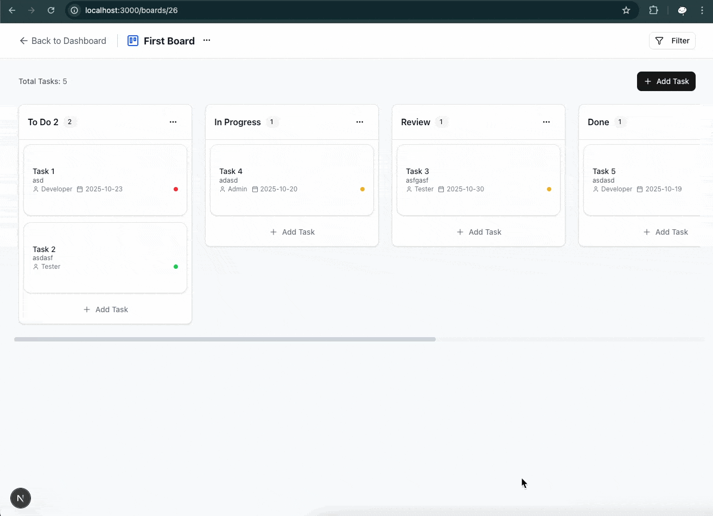
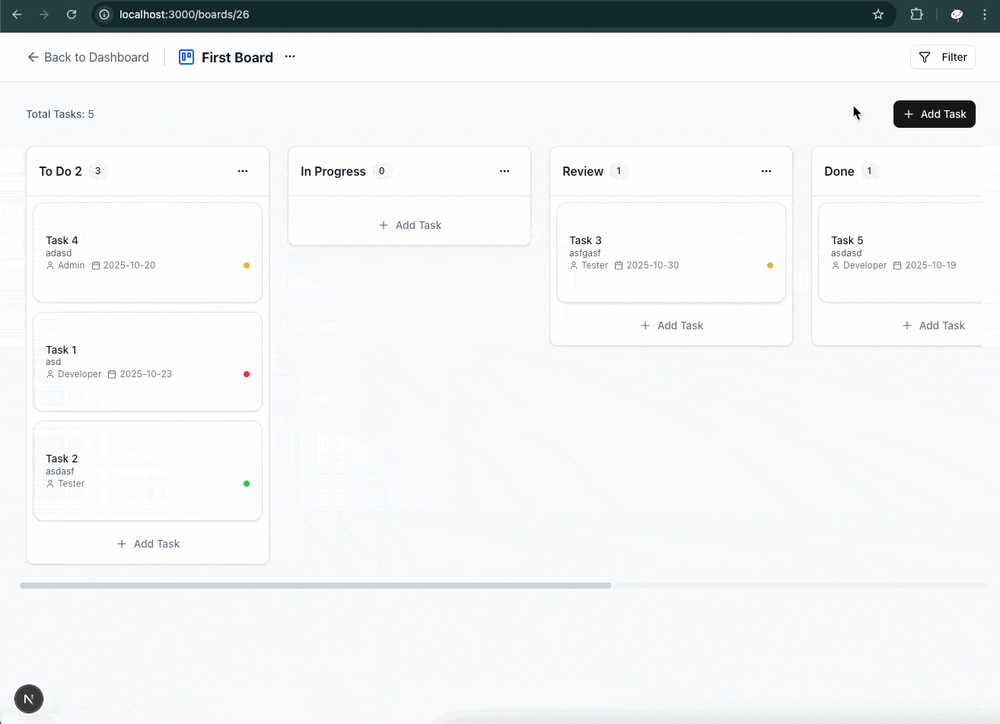
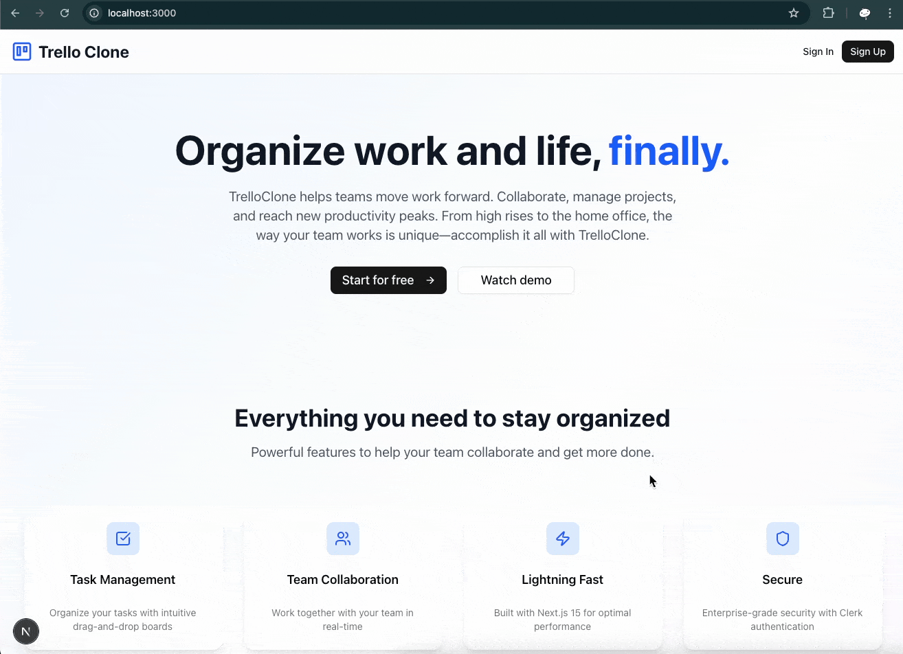

⚠️In progress...⚠️

<h3 align="center">Trello Clone</h3>

## Table of Contents

1. [Introduction](#introduction)
2. [Note](#note)
3. [Demo](#demo)
4. [Tech Stack](#tech-stack)
5. [Features](#features)
6. [Additional Feature](#additional)
7. [Quick Start](#quick-start)
8. [What I learned](#learn)
9. [Implementation Notes](#implementation-notes)
10. [Missing Features](#missing)
11. [Known Bugs](#bugs)

## <a name="introduction">Introduction</a>

Trello‑Style App using Next.js, Supabase, Clerk, dnd‑kit, and TailwindCSS with authentication & billing, drag‑and‑drop, and filtering.

## <a name="note">⚠️ Note</a>

This project was implemented based on a tutorial video on YouTube from PedroTech [Build a Fullstack Trello App with NextJS 15, Supabase, TailwindCSS, Drag & Drop](https://www.youtube.com/watch?v=ugxI1o5SyMs).

Good project idea, tech stack, folder structure, and UI design. This project also teaches you how to create a `Custom React Hook` and a `Custom React Context`, which I think is very useful. But for code inside `page.tsx`, it has a long code. It is better to separate it into different components, but I also left it as it is to make it easier to follow the tutorial (e.g., the Board page got 942 lines of code, the Dashboard page got 567 lines of code after I added more features).

Not all features were implemented in the tutorial video. The drag and drop functionality is not well handled, so it is not working as expected. However, I managed to add those features, improve some UX/UI, and fix the issues as I could think of.

## <a name="demo">Demo</a>

Click on each section to toggle the demo image.

<details>
  <summary>
    Authentication
  </summary>
  <b>Sign up</b>
  <div>
    <a href="">
        
    </a>
  </div>
  <b>Sign in</b>
  <div>
    <a href="">
      
    </a>
  </div>
</details>
<details>
  <summary>
    Authenticated User
  </summary>
  <div>
    <details>
      <summary>
        Dashboard page
      </summary>
      <b>Create new board</b>
      <div>
        <a href="">
          
        </a>
      </div>
      <b>Filter and search board (Edit board created_at to demo date filtering)</b>
      <div>
        <a href="">
          
        </a>
      </div>
      <b>Boards view setting</b>
      <div>
        <a href="">
          
        </a>
      </div>
      <b>Upgrade plan</b>
      <div>
        <a href="">
          
        </a>
      </div>
    </details>
    <details>
      <summary>
        Board page
      </summary>
      <b>Edit board</b>
      <div>
        <a href="">
          
        </a>
      </div>
      <b>Add/Edit Column</b>
      <div>
        <a href="">
          
        </a>
      </div>
      <b>Add task</b>
      <div>
        <a href="">
          
        </a>
      </div>
      <b>Drag and drop task to reorder task in same column</b>
      <div>
        <a href="">
          
        </a>
      </div>
      <b>Drag and drop task to change column</b>
      <div>
        <a href="">
          
        </a>
      </div>
      <b>Filter task</b>
      <div>
        <a href="">
          
        </a>
      </div>
    </details>
  </div>
</details>
<details>
  <summary>
    Unauthenticated User
  </summary>
  <div>
    <b>Home page</b>
    <div>
      <a href="">
        
      </a>
    </div>
  </div>
</details>

## <a name="tech-stack">Tech Stack</a>

- Next.js - React framework for full-stack web application development
- React - JavaScript library
- TypeScript - JavaScript superset for type safety
- Supabase – cloud PostgreSQL database service @supabase/
- Clerk - Authentication & subscription billing integration Middleware with pre-built UI components and themes
- Tailwind CSS v4 - CSS framework
- Shadcn UI - UI component library using primitives from Radix UI
- @dnd-kit – Primitives, Hook and functionality for create Drag‑and‑drop UI (I used `@dnd-kit/core`, `@dnd-kit/sortable` and `@dnd-kit/utilities`)
- Lucide React - Icon library for React
- tw-animate-css - Collection of utility classes for Tailwind CSS animations

## <a name="features">Features</a>

- Create multiple boards
- Define custom columns.
- Add new tasks with title, description, assignee, priority & due date.
- Reorder tasks and move them between columns by drag and drop with smooth animations.
- Filterable boards with title, date range.
- Filterable tasks with priority, due date.
- Sign up / log in with Clerk and upgrade your plan to create unlimited boards.

## <a name="additional">Additional Feature</a>

- Dashboard page
  - Filter
    - Display filter count
    - Filter board by task count
    - Dashboard
- Board page
  - Filter
    - Display color for each priority
    - Create a task on each column instead of defaulting to the first column
    - Filter task by assignee

## <a name="quick-start">Quick Start</a>

Follow these steps to set up the project locally on your machine.

### Prerequisites

- Git
- Node.js
- npm

### Cloning the Repository

```bash
git clone https://github.com/bank8426/nextjs-trello-clone.git
cd nextjs-trello-clone
```

### Installation

Install the project dependencies using npm:

```bash
npm install
```

### Set Up Environment Variables

1. Create a new file named `.env` and copy the content inside `.env.example`
2. Replace the placeholder values with your actual credentials

```env
# https://dashboard.clerk.com/ - create a new app and take API keys
NEXT_PUBLIC_CLERK_PUBLISHABLE_KEY=
CLERK_SECRET_KEY=

# https://supabase.com/dashboard - create a new project and take the Project API keys
NEXT_PUBLIC_SUPERBASE_URL=
NEXT_PUBLIC_SUPERBASE_ANON_KEY=
```

### Running the Project

```bash
npm run dev
```

Your server will run on [http://localhost:3000](http://localhost:3000/)

## <a name="learn">What I learned</a>

`Supabase`

- Supabase, Row Level Security (RLS) policies are `PostgreSQL rules` to restrict access to data(SELECT, INSERT, UPDATE, and DELETE) in a table based on a user's identity or attributes. The benefit of this is to prevent other users from seeing another user's data by configuring on the database level. And by default, when you enable RLS, there will be no rule yet. So that prevents you from accessing or doing anything until you set it up. To set it, you just need to create a condition that you want and apply it to all SELECT, INSERT, UPDATE, and DELETE statements that use the same condition.

`Tailwind`

- utility class `group` - use to mark that element and children as a `group element`
- utility class `group-hover:<style>` - use to apply style to that element when the `group element` is hovered over

`React`

- Custom hook - is like you use normal React hook (e.g., `useEffect`, `useState`) in a component, but you can bundle them into a custom hook file first before importing it and reusing it in any other component.
- Custom context - is something you will use when you need to pass data from a parent component to child/grandchild/very nested component without using props drilling (passing props from parent to child/grandchild/very nested component one by one). First, in the custom context file, you need to `createContext` with `props` that you want to pass, then create a `Provider` component, which is the wrapper component that provides data for those `props` to any component under it. You can also allow your provider to access data from outside, such as `PlanProvider`, or self-close `Provider` instances, like `SupabaseProvider`, in this project. Then create a custom context from `useContext`, which will be used in any component under the `Provider` component to access that data. See more [Custom Context](https://react.dev/learn/passing-data-deeply-with-context)

`Clerk`

- This is the second time I used Clerk. I used it in the previous project [Next.js Calendly Clone](https://github.com/bank8426/calendly-clone-next) for authentication only. But this time, with additional billing and subscription features, which also have `Clerk` built-in UI components. You can just set up a pricing plan in the Clerk dashboard and use "@clerk/nextjs/server" to get the user's plan information. Clerk also provides pricing plan UI components that we can use to display pricing plans in our app, which also has subscription and billing integration without doing any additional work.

## <a name="implementation-note">Implementation Notes</a>

- Clerk & Supabase integration (See more in [Clerk & Supabase](https://supabase.com/partners/integrations/clerk))

  - Get `user id` in RLS policies

    - `Clerk` authentication with `Supabase` database, `requesting_user_id()`(function we need to create based on clerk doc) will return `user id` from `clerk`

    ```sql
    with check (
      (requesting_user_id() = user_id)
    )
    ```

    - `Supabase` authentication with `Supabase` database, `auth.uid()` will return `user id` from `supabase`

    ```sql
    with check (
      ((auth.uid())::text = user_id)
    )
    ```

- APP

  - App stuck at `Loading...` forever when the `session` expired
    - This happens because we did not handle `session` well enough in `SupabaseProvider.tsx`. In the tutorial, we check only if `session` is `undefined`, then we call `return` and wait until `session` is available. But if the user is not signed in or the `session` has expired, the `session` will still be `undefined` and stuck at that state forever. So I add `isLoaded`, which comes from `useSession` in `@clerk/nextjs`, to check the loading state of `session`. If `session` is loaded successfully so we can continue to create a `supabase` client without `session`. Other than `isLoaded`, `useSession` also has `isSignedIn` to check if the user is signed in or not. (See [useSession](https://clerk.com/docs/nextjs/reference/hooks/use-session) for more details.)

  ```js
    const { session } = useSession();
    ...
    useEffect(() => {
      // when the session is not available
      if (!session) {
        return;
      }

      const client = createClient(
      process.env.NEXT_PUBLIC_SUPERBASE_URL!,
      process.env.NEXT_PUBLIC_SUPERBASE_ANON_KEY!,
      {
        accessToken: async () => session?.getToken() ?? null,
      }
    );

    setSupabase(client);
    setIsLoaded(true);
    }, [session]);
  ```

  ```js
    const { isLoaded: isSessionLoaded, session } = useSession();
    ...
    useEffect(() => {
      // when still loading session
      if (!isSessionLoaded && !session) {
        return;
      }
      ... // the rest of the code
    }, [isSessionLoaded, session]);
  ```

- Shadcn
  - Select component (Select dropdown)
    - I try to allow the user to be able to select a column when creating a task by adding a new dropdown list with `value` as `column.id`. But `value` has `prop type` as `string`, which makes the component not work correctly when used with `column.id`, which is `number`. So the dropdown list value will disappear after I select an item inside. So I need to parse `column.id` to `string` first before using it in the component, and then everything works fine.( P.S.This mismatch type of `column.id` also causes a similar issue with all condition checking with triple equal operator `===`.)

## <a name="missing">Missing Features</a>

A feature that I think it should have

- Board Page
  - Delete Board
  - Reorder column
  - Edit/Delete task

## <a name="bugs">Known Bugs</a>

- Reordering Tasks results in moving the Task to another Column

  - This happened when dragging and dropping one task over another task that has `id` matched with `Task id` and also `Column id` of a different Column. When `handleDragEnd` is executed, the code inside `handleDragEnd` will consider this action as `move task to another column` since it matched the first condition of `if-else`, which checks if `over.id is matched with column.id`, which gives an unintended result. But this can't be fixed by rearranging the `if-else` condition.

  - Root cause
    - When we set up `table` in `db`, we use `number` as `id`, which means it is `not unique` and `can be misused` for `id` in `other table` which uses `number` as `id` as well. I try to migrate the type of `id` to `uuid`, but `db` is not allowed, even after cleaning up all data.
  - Workaround
    - I give `DroppableColumn` component a different `id` ("column\_`${column.id}`") instead, and make `handleDragEnd` to check column based on the new id format that we assigned instead.
